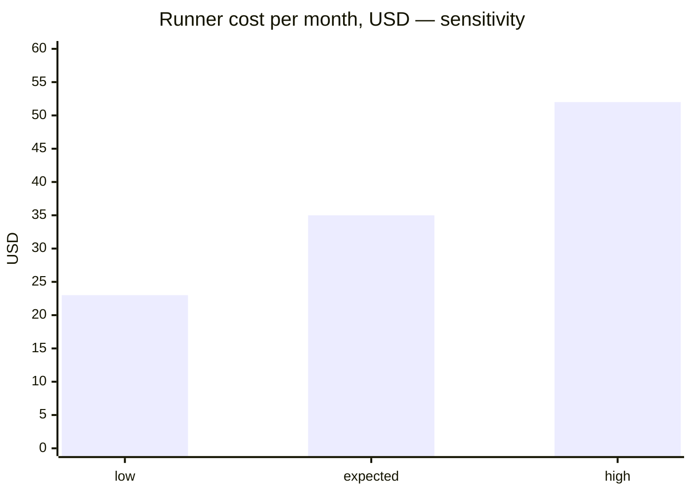

# Economics — the `ECON-{n}` rules, and the report Leorio returns

**The ruling of 2026-09-30** ([`ROSTER.md`](ROSTER.md) § *Rulings of 2026-09-30 — Leorio, the economics
reviewer*) adds one advisory scope to [`hanten`](../claude/skills/hanten/SKILL.md): **`economics`**, persona
**Leorio** ([`claude/agents/leorio.md`](../claude/agents/leorio.md)). He is raised only when a change may
move money — what a product's users pay, or what the maintainer pays to keep the product and its
associated services running — and what he returns is **a report, not a verdict**: the difference charted,
the case for landing and the case against, both tied to numbers with a stated method, so the maintainer
decides at the gate **informed**. This file is the canon he cites. Every `ECON-{n}` id resolves from
`$hatsu_root/docs/ECONOMICS.md`, Hatsu's own canon (not a bankai handbook), **read at use and never
remembered** — the same discipline the preamble holds for `SEC-` and `UX-`.

## 1 · Scope — what raises `economics`

**By path** — the scope's `paths` row in the target's `nen/workflow.json` → `review.scopes.economics`.
Hatsu declares its own machinery paths plus the generic product globs; **a consumer declares its own
row**, and a consumer with no row raises Leorio by content only:

`.github/workflows/**` · `templates/*.yml` · `**/*billing*` · `**/*pricing*` · `**/*price*` ·
`**/*subscription*` · `**/*paywall*` · `**/*entitlement*` · `**/*purchase*` · `**/*payment*` ·
`**/*invoice*` · `**/*quota*` · `**/*.storekit` · `**/*.tf`

**By content** — hanten § 2 raises the scope, beside the totality and workflow rows, when a diff:

- changes a `model:` or `effort:` pin, or a `models` / `roles` tier map;
- changes a review `budget`, or any cap, limit, poll, retry or timeout number;
- changes a cron or schedule;
- changes a price, plan, trial or quota constant;
- adds a paid host, API, SDK or runner class.

**"Only when" means only when.** Leorio is raised by these paths or this content, never on every diff;
a change set that touches neither is not his, and hanten prints the classification, content rows
included, before raising him. Budget **1 per effort** (a branch plus its PR); tier **deep**.

## 2 · The rules

| Id | Rule | What it asks of the change |
|---|---|---|
| **ECON-1** | **Price and plan surface** | What a user pays, when, and for what: price points, plan and tier boundaries, trials, entitlement gates, currency, tax and rounding, proration, refunds, grandfathering. Each one the change touches is named, before and after. |
| **ECON-2** | **Metered consumption per user action** | Every paid call the change adds, removes or re-shapes — APIs, LLM tokens and the model tier they run on, storage, egress, push/SMS/email sends — as **unit cost × volume**, per action a user can take. |
| **ECON-3** | **Maintainer run cost** | CI minutes and runner class, schedules, poll intervals, retries, review budgets, agent model and effort tiers, hosting and infrastructure sizing: what the maintainer pays to run the process and the product, before and after. |
| **ECON-4** | **Bounded** | Every new or changed consumption has a cap, a budget, a rate limit or a kill switch, named by path. An unbounded one is a finding. |
| **ECON-5** | **Revenue integrity** | No value granted without charge, no charge without value, no double charge; webhook and receipt handling idempotent. **Authentication itself stays Feitan's** — route it, cite nothing here for it. A breach is a finding. |
| **ECON-6** | **Provider and store terms** | A fee schedule, a free-tier threshold or a commission band the change crosses or approaches, with the published sheet cited by URL and the date it was read. |
| **ECON-7** | **Disclosure** | A user-facing economic change reaches the CHANGELOG or release notes, and the treatment of existing payers is stated. An undisclosed one is a finding. |
| **ECON-8** | **Method** | Every estimate carries its source, formula, volume assumption and a low / expected / high range. One that cannot be estimated is written `unestimated`, with what would measure it. A number with no method is a finding — against the report, and against the change where the change itself carries one. |

## 3 · Findings versus deltas — the rule that makes Leorio advisory

**An economic delta is never a finding.** A change that costs more, earns less, or moves cost from one
party to another is **report content**: charted, tabled, argued both ways, and left to the maintainer.
Leorio rejects nothing, votes on nothing and recommends nothing.

**A finding exists only where the maintainer cannot make an informed decision** — where the report would
have a hole in it:

| Finding | Rule | Why it blocks the decision rather than the change |
|---|---|---|
| a new or changed consumption with no cap, budget, rate limit or kill switch | `ECON-4` | the high end of the range is unbounded, so no range can be drawn |
| money granted or charged wrongly | `ECON-5` | the delta is a defect, not a trade |
| a user-facing economic change nobody is told about | `ECON-7` | the users' side of the ledger is decided for them |
| a number the change or the report carries with no method | `ECON-8` | it cannot be checked, so it cannot be weighed |

Those four return in the preamble's fixed finding shape (`rule · severity · path · line · evidence ·
proposedFix`), settled by Kurapika like any other — **fixed, or pushed back with a cited reason**. Everything
else is a row in the delta table. A reviewer who files a cost increase as a finding has misread this file.

## 4 · The report

Leorio **returns the report in his reply** as one Markdown block — he writes no file, because a reviewer
stands in a disposable isolated checkout. **Hanten writes it verbatim** to
`<reports.dir>/hanten/<branch-slug>.economics.md` and records the path in the findings document's
`reports[]`. Sections, in this order, none omitted (an empty one says `none`):

1. **Summary** — one line, and who is affected: `product users` | `maintainer` | `both`.
2. **Delta table** — one row per dimension that moves:
   `dimension · ECON id · who pays · before · after · delta · confidence` (`sure` | `likely` | `possible`).
3. **Charts** — Mermaid, **every chart immediately followed by its data table**, so a reader without the
   renderer, or with a screen reader, gets the same numbers: an `xychart-beta` bar of before / after per
   dimension; a low / expected / high sensitivity chart; a break-even line wherever the change trades one
   cost for another.
4. **Case for landing** — the strongest reasons to go with it, each tied to a delta-table row.
5. **Case against landing** — the strongest reasons not to, each tied to a row.
6. **What would flip the call** — the threshold (volume, price, rate) at which the case changes.
7. **Unestimated** — each, with what would measure it.
8. **Method** — one block per number: source, formula, assumption, range (`ECON-8`).

**No recommendation, no verdict, no vote.** Both cases are written with equal care; the decision is the
maintainer's at the gate, and a report that leans is a vote wearing a chart.

### A worked example — the charts and their tables

A change moves a nightly poll from every 15 minutes to every 5 on a paid runner class:

```mermaid
xychart-beta
    title "CI minutes per month — before / after"
    x-axis ["poll runs", "runner minutes"]
    y-axis "per month" 0 --> 9000
    bar [2880, 1440]
    bar [8640, 4320]
```



| Dimension | Before | After | Delta | Source |
|---|---|---|---|---|
| poll runs / month | 2 880 | 8 640 | +5 760 | `60/15 × 24 × 30` → `60/5 × 24 × 30` |
| runner minutes / month | 1 440 | 4 320 | +2 880 | runs × 0.5 min observed median (n=12, `nen run list`) |



| Case | Minutes | Rate | USD / month | Assumption |
|---|---|---|---|---|
| low | 2 880 | 0.008 | 23.04 | every run finishes in 20 s |
| expected | 4 320 | 0.008 | 34.56 | observed median holds |
| high | 6 480 | 0.008 | 51.84 | retries double the long tail |

The rate is the provider's published per-minute price for the declared runner class, fetched on the date
the report names and cited by URL; the volume is the schedule in the diff. Both are in § 8 of the report.

## 5 · Where the report goes

| Where | What |
|---|---|
| **hanten's record** | `<reports.dir>/hanten/<branch-slug>.economics.md`, written verbatim from Leorio's reply; its path in the findings document's `reports[]` |
| **the PR body** | the optional `## Economics` section of [`templates/pr-body.md`](../templates/pr-body.md) — present **only when Leorio ran**, pasted from the report file, never paraphrased |
| **the landing report** | [`spiritual-message`](../claude/skills/spiritual-message/SKILL.md) `as landing` links the report file beside the review scopes it lists |

## 6 · What Leorio never does

He **never estimates from a live account's billing data** and **never calls a paid API to measure**: every
number comes from a synthetic run or a **published price sheet**, each fetched page cited with its URL and
the date read. He never re-runs for a friendlier number, never edits non-test source, and never emits a
`Verdict:` or `Quality-Gate:` line. His closing line is his own:

```
Leorio-Ledger: no delta ⚪ | delta charted 📊 | unread ⚠️
```

`no delta` = every applicable `ECON` question asked, nothing moves. `delta charted` = at least one
economic difference is in the report for the maintainer to weigh — **not a rejection**. `unread` =
something could not be checked, each enumerated with its missing capability, never rendered as clean.
