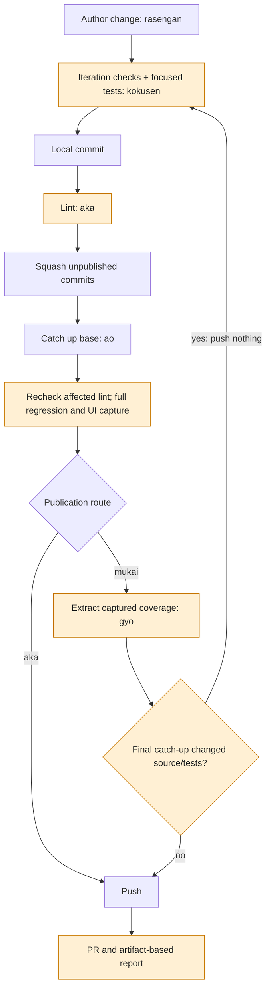
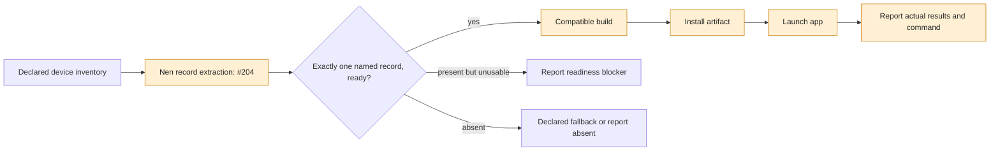
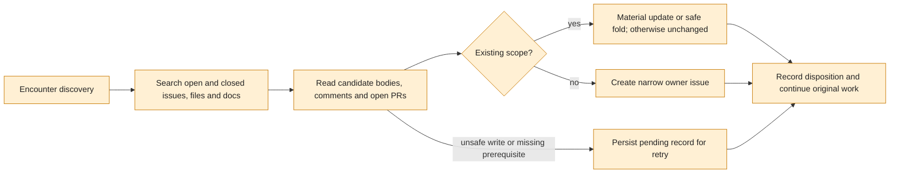

# Hatsu #48/#49 — current canon to proposed flow

Comparison against this effort's `origin/main` baseline. **Bold** cells and orange diagram nodes
identify changed obligations. Nen #204 is delivered separately in Nen PR #206; no tag is cut here.

| Step | Before | After this proposal |
|---|---|---|
| breath | Declared iteration checks; build composite could request tests during warmup | Iteration checks prove the base; **full regression is reserved for publication** |
| rasengan | Authoring feedback from iteration checks | Same feedback, with **declared focused tests where applicable** |
| kokusen | Run `iteration.checks`, then commit; no independent focused-test obligation | **Finished-tree focused tests before commit**, alongside iteration checks; refuse red |
| aka | Required tests → squash → catch up → push | **Lint → squash → catch up → full regression with capture → push**; recheck lint if catch-up changes source/tests |
| tsukuyomi / UI tests | Suite execution could recur in composites | **One publication owner**; reports parse the captured runner artifacts |
| mukai / gyo | Coverage could invoke a suite again; intermediate push could precede final coverage proof | **Extract and gate matching captured coverage without rerunning tests**; a changed catch-up returns to verification before any push |
| amaterasu | Declared target launch and after-steps, readiness/fallback protections | **Explicit compatible build → install → launch on the ready physical target each applicable turn**; shared record extraction replaces consumer parsing only after release and device proof |
| jujutsu | Device registration and declaration | **Same shared discovery shape as amaterasu**; registration is not successful artifact delivery |
| rikugan / ren | Completion and evidence could imply extra verification | **Report existing evidence and actual delivery truthfully**, with no hidden test/coverage reruns |
| Discovery (#49) | Filing skill centered on explicit invocation and a proposed plan | **Standing encounter authority**: reconcile first, then create/update/fold, or persist a retryable pending record; no new implementation or gate authority |
| Release | Existing release prerequisites | **#49 included before any new tag is considered**; Nen publication and consumer proof remain separate downstream steps |

Hatsu itself declares `iteration.checks: [lint]` and no automated suite. The focused-test obligation
applies when a declared test lane covers the authored behavior. Nen's `device-records` lane is the
working example. Dynamic per-change test selection remains [Nen #207](https://github.com/zheref/nen/issues/207);
KroApple's Python probe tests do not prove Swift feature behavior.

Whole-body concurrent updates remain bounded by [Nen #205](https://github.com/zheref/nen/issues/205).
The flow refuses to claim atomicity or repeatedly file the same uncertainty.
